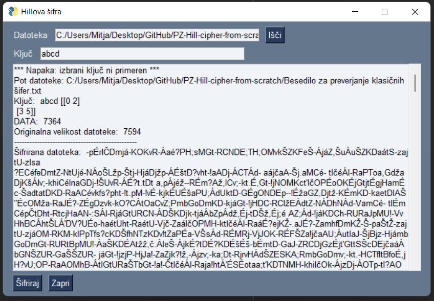

# Hill cipher from scratch

We prepared simple application with user interface in Python, where we demonstrate implementation of Hill cipher.

## How Hill cipher it works

Hill cipher is a polygraphic substitution cipher based on linear algebra, invented by Lester S. Hill in 1929. Hill used matrices and matrix multiplication to mix up the plaintext.

Considerations of use Hill ciphers is number of possible keys, where is requirements to be `n x n` matrix and has inverse, otherwise matrix multiplication cannot be possible. So we need also padded plaintext to correctly length that matches matrix dimension.

A detailed explanation of how the Hill cipher works can be found at:

http://practicalcryptography.com/ciphers/classical-era/hill/

## Our work

We implement Hill cipher to support slovenian alphabet. So we get an old Slovenian story about Martin Krpan for the test.

The implementation is in the form of a program that includes the following functionalities:

- entering and opening the text file we want to encrypt,
- entering and opening the text file we want to decrypt,
- preview of encrypted / decrypted text,
- encrypting and decrypting text with a chosen key entered by the user (what the 'key' is depends on the cipher).

